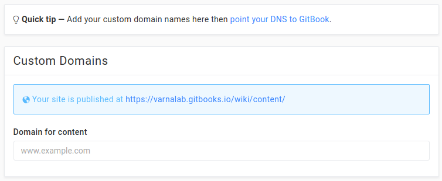

# Ииии така

push, mush интересна работа

## Как се използва това уики?

```bash
git clone git@github.com:varnalab/wiki
```

После яко markdown .. щото е яко:

- [Features in GitHub](https://help.github.com/articles/basic-writing-and-formatting-syntax/)
- [GFM Features in GitHub](https://guides.github.com/features/mastering-markdown/)

яяя това от къде го пейстнааах

---

Таа пиша разни работи и накрая:

```bash
git push origin master
```

изчаквам няколко секунди и гтоо, съдържанието ми е хостнато на:

https://varnalab.gitbooks.io/wiki

Остава да конфигурираме DNS-ите:


